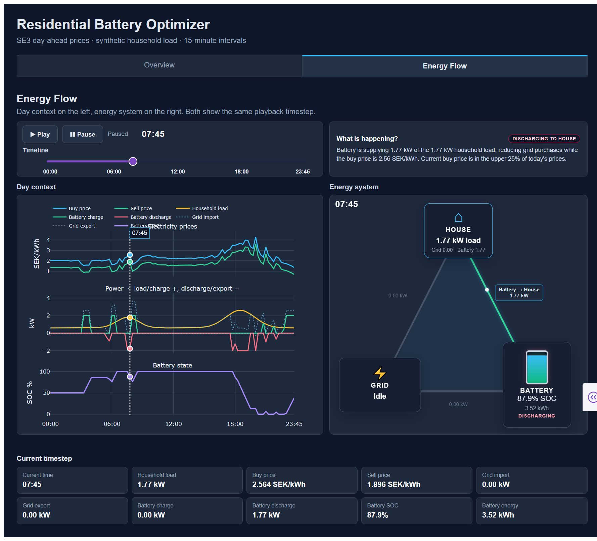
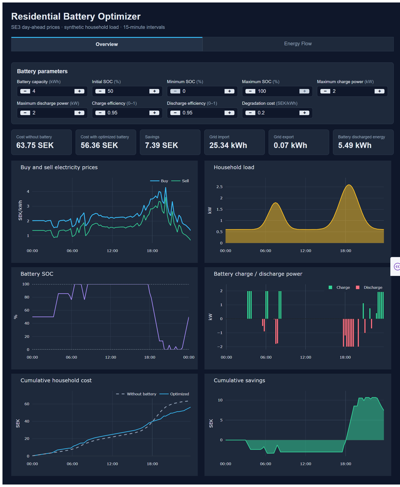

# Residential Battery Energy Optimizer

An interactive energy optimization project that determines when a household battery should charge, discharge, import from the grid, or export electricity in order to minimize household electricity cost.

The model combines:

- SE3 day-ahead electricity prices
- household electricity demand
- battery capacity and power limits
- charging/discharging efficiency
- asymmetric electricity buy/sell prices
- battery degradation cost

The Dash application visualizes the optimized energy flows between the grid, household, and battery throughout the day, and compares the result with the same household operating without a battery.

> **Current version:** deterministic 15-minute optimization using known day-ahead prices and a synthetic household load profile.

## Live demo

[Open the deployed application](https://energy-optimizer.thankfulsand-6fed6a90.germanywestcentral.azurecontainerapps.io/)

## Demo

### Energy flow

### Overview

## What the project demonstrates

- Linear optimization of residential battery operation
- Household/grid/battery power-flow modeling
- Dynamic electricity pricing
- Battery state-of-charge constraints
- Cost and savings analysis
- Interactive visualization of energy flows and optimization decisions

