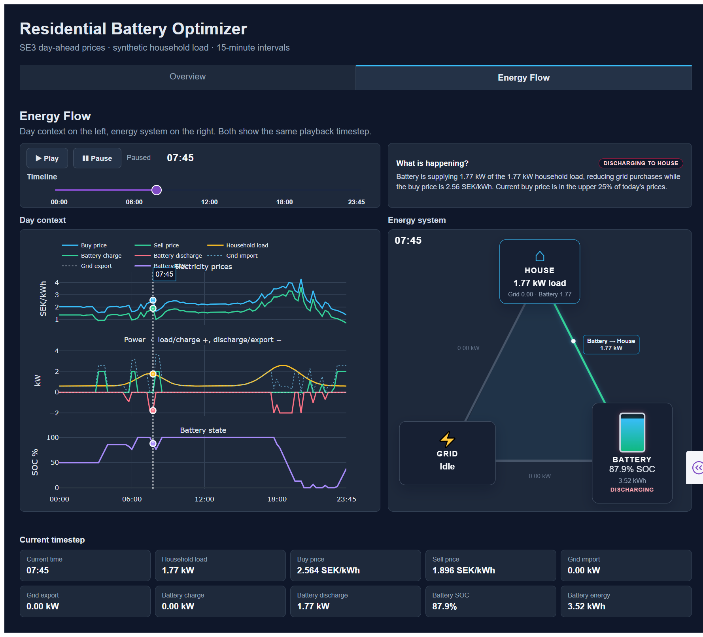
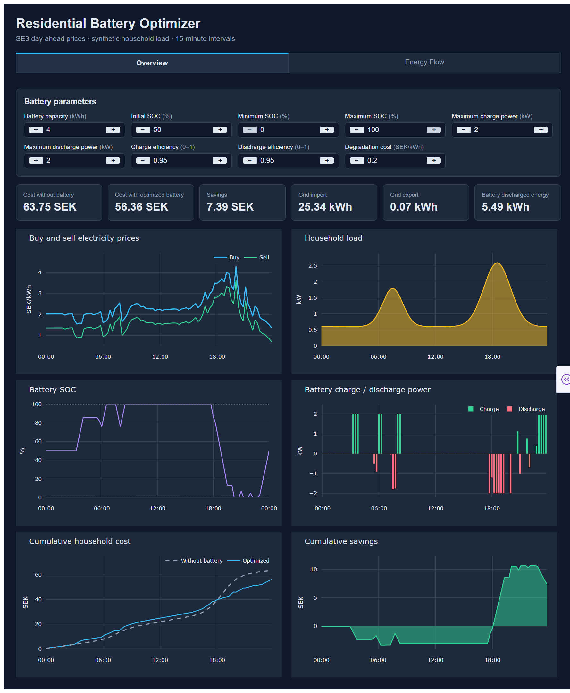

# Residential Battery Energy Optimizer

An interactive energy optimization project that determines when a household battery should charge, discharge, import from the grid, or export electricity in order to minimize household electricity cost.

The model combines:

- SE3 day-ahead electricity prices
- household electricity demand
- battery capacity and power limits
- charging/discharging efficiency
- asymmetric electricity buy/sell prices
- battery degradation cost

The model optimizes battery operation over 15-minute intervals while respecting battery state-of-charge and power-flow constraints.

A Dash application visualizes the resulting energy flows between the grid, household, and battery throughout the day and compares the optimized solution with the same household operating without a battery.

> **Current version:** deterministic 15-minute optimization using known day-ahead prices and a synthetic household load profile.

## Live demo

[Open the deployed application](https://energy-optimizer.thankfulsand-6fed6a90.germanywestcentral.azurecontainerapps.io/)

## Demo

### Energy flow

### Overview

## How it works

The optimization determines battery charging and discharging decisions for each 15-minute period of the day.

The objective is to minimize total household electricity cost while accounting for electricity purchases, electricity exports, battery efficiency losses, and degradation cost.

The model is subject to constraints including:

- battery state-of-charge limits
- maximum charging and discharging power
- battery energy balance between time periods
- household electricity demand
- grid import and export flows

The optimization problem is formulated in Python using PuLP and solved with GLPK.

## What the project demonstrates

- Linear optimization of residential battery operation
- Time-dependent electricity pricing
- Battery state-of-charge modeling
- Household/grid/battery power-flow constraints
- Cost and savings analysis
- Interactive visualization of optimization decisions
- Containerized application deployment

## Tech stack

- Python
- PuLP
- GLPK
- pandas
- NumPy
- Dash
- Plotly
- Docker
- Azure Container Apps

